# 铸军魂之路：三湾改编专题网站 — 项目说明文档

---

## 一、项目概述

"铸军魂之路：三湾改编专题网站"是一个以**三湾改编**这一重大历史事件为主题的红色教育专题网站。三湾改编发生于1927年9月29日至10月3日，是中国共产党建设新型人民军队的重要开端。本网站旨在通过图文并茂的方式，向浏览者全面、系统地介绍三湾改编的历史背景、主要内容、历史意义与深远影响。

**项目信息：**
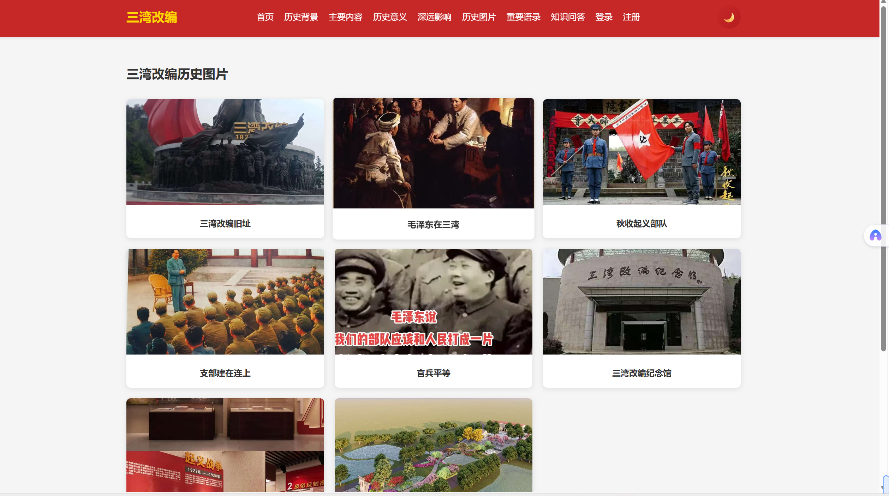

---

## 二、网站主题与设计目标

### 2.1 主题定位

网站以红色革命历史为主题，采用庄重、大气的设计风格。整体色调以**中国红（#c62828）**为主色、**金色（#ffd700）**为辅色，配以深灰底色的页脚，营造出严肃而又富有历史厚重感的视觉氛围。这种配色既契合红色教育主题，又能体现对革命先辈的敬意。

### 2.2 设计目标

- **知识传播**：系统梳理三湾改编的来龙去脉，让浏览者全面了解这一历史事件
- **互动体验**：通过轮播图、时间轴、知识问答等互动元素，提升用户参与感
- **视觉呈现**：通过历史图片展示和画廊功能，直观呈现三湾改编的历史场景
- **响应式适配**：支持桌面端与移动端浏览，确保不同设备上的良好体验

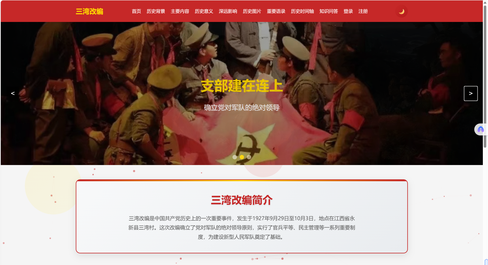

---

## 三、网站整体结构

网站共有 **11个页面**，通过统一的导航栏实现页面间跳转，结构如下：

```
首页 (index.html)
├── 历史背景 (pages/background.html)
├── 主要内容 (pages/content.html)
├── 历史意义 (pages/significance.html)
├── 深远影响 (pages/influence.html)
├── 历史图片 (pages/gallery.html)
├── 重要语录 (pages/quotes.html)
├── 历史时间轴 (pages/timeline.html)
├── 知识问答 (pages/quiz.html)
├── 登录 (pages/login.html)
└── 注册 (pages/register.html)
```

每个子页面均包含统一设计的导航栏和页脚，保持网站风格的一致性。

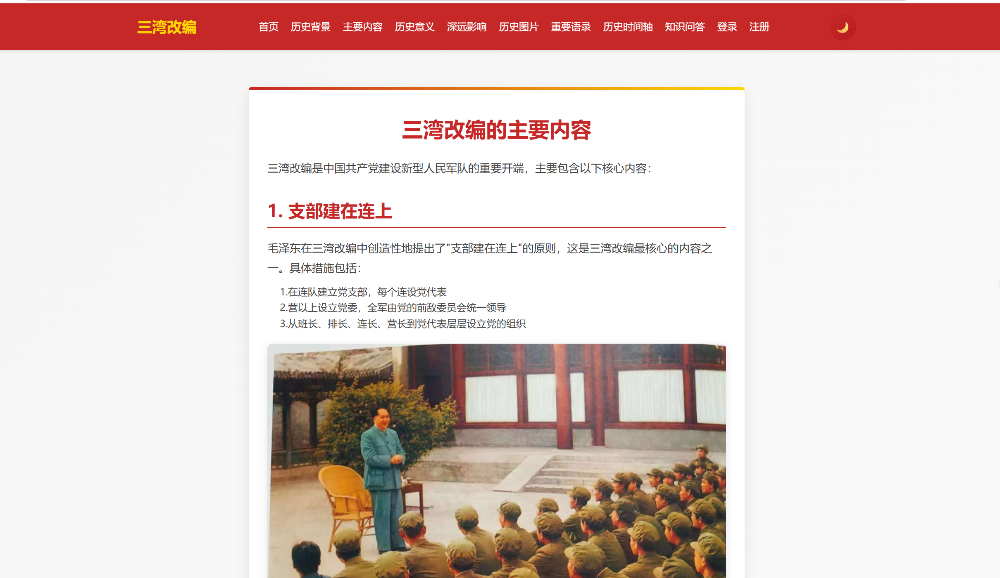

---

## 四、各页面详细介绍

### 4.1 首页（index.html）

首页是网站的门面，承担着吸引用户和引导导航的双重功能。

**页面组成：**

1. **顶部导航栏**：固定在页面顶部（sticky），包含网站Logo"三湾改编"（金色字体）、11个导航链接、移动端汉堡菜单按钮以及明暗主题切换按钮。导航栏采用深红色背景，随页面滚动始终保持可见。

2. **粒子背景**：使用Canvas绘制的动态粒子效果，粒子在页面中缓慢飘动，彼此之间形成连线，营造出富有科技感的视觉氛围。粒子颜色与主题色保持一致。

3. **视差装饰元素**：三个半透明的红/金色圆形浮动装饰，随页面滚动以不同速度移动（视差效果），增加页面的层次感和动态感。

4. **轮播图**：三张高质量的轮播图片，分别展示"铸军魂之路"、"支部建在连上"、"官兵平等"三个核心主题。轮播图每4秒自动切换，支持手动前后切换和指示器点击，鼠标悬停时暂停轮播。

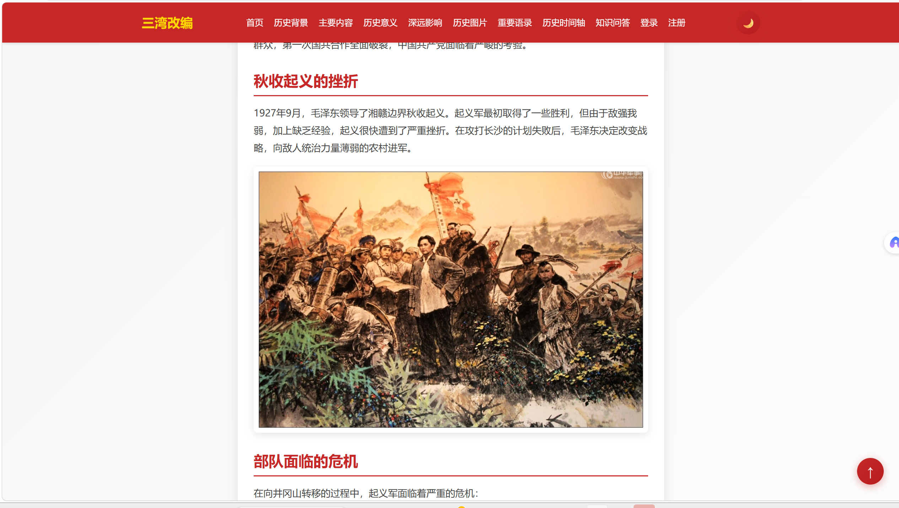

5. **简介区域**：以白色卡片形式展示三湾改编的简要介绍，卡片顶部有红金渐变装饰条，文字居中排版，清晰易读。

6. **四大功能卡片**：以网格布局排列的四张卡片，分别链接到"历史背景"、"主要内容"、"历史意义"、"深远影响"四个子页面。每张卡片配有背景图片和半透明遮罩，鼠标悬停时卡片上浮，提供视觉反馈。

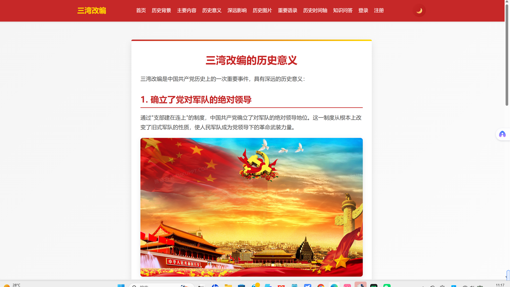

7. **页脚**：三栏布局，包含网站信息、快速链接和联系方式，所有子页面均复用此页脚。

---

### 4.2 历史背景（pages/background.html）

该页面详细介绍三湾改编发生的时代背景。

**内容要点：**
- 1927年大革命失败后的危急形势
- 秋收起义的经过与挫折
- 起义部队面临的严峻危机（减员严重、士气低落、组织松散、军阀主义）
- 选择三湾村进行改编的原因

页面中嵌入了三张历史图片（秋收起义图、部队危机图、三湾村图），图文并茂地还原历史场景。页面顶部有横幅装饰图，整体使用白色内容卡片配合红金顶部装饰条的设计。

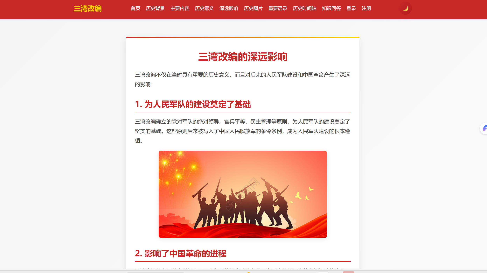

---

### 4.3 主要内容（pages/content.html）

该页面是三湾改编的知识核心，详细阐述了三湾改编的四项主要内容。

**内容要点：**
1. **支部建在连上**：在连队建立党支部，确立党对军队的绝对领导
2. **官兵平等**：取消军官特权、建立士兵委员会、实行经济公开、禁止打骂士兵
3. **缩编部队**：将一个师缩编为一个团，淘汰不坚定分子，精简机关充实连队
4. **建立严格纪律**：规定三大纪律六项注意的雏形，建立奖惩制度

每项内容均配有相关历史图片，帮助浏览者更直观地理解改编的具体措施。

---

### 4.4 历史意义（pages/significance.html）

该页面总结了三湾改编的五大历史意义。

**内容要点：**
1. 确立了党对军队的绝对领导
2. 创建了新型人民军队
3. 增强了军队的凝聚力和战斗力
4. 为中国革命的胜利奠定了基础
5. 丰富了马克思主义军事理论

页面中插入了"党对军队的绝对领导"和"军队凝聚力"等主题图片。

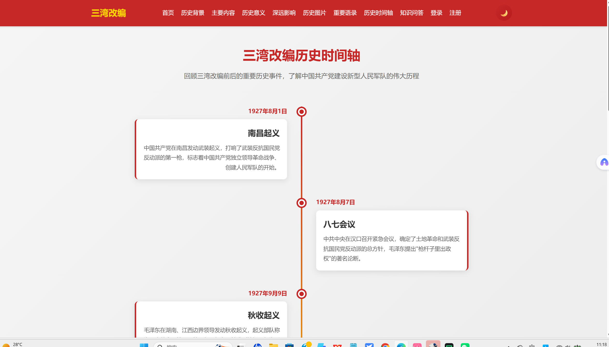

---

### 4.5 深远影响（pages/influence.html）

该页面探讨了三湾改编对后世的四大深远影响。

**内容要点：**
1. 为人民军队的建设奠定了基础
2. 影响了中国革命的进程
3. 对当代中国军队建设的启示
4. 成为中国共产党的重要历史遗产

页面配有四张对应主题的图片，内容详实，论述深入。


---

### 4.6 历史图片（pages/gallery.html）

该页面以**图片画廊**的形式展示三湾改编相关的历史图片。

**功能特点：**
- 8张历史图片以响应式网格布局排列
- 图片采用**懒加载（Lazy Loading）**技术，仅在图片进入视口时才加载，优化页面性能
- 点击任意图片可打开**灯箱（Lightbox）**，全屏查看大图
- 灯箱支持ESC键关闭，点击背景区域也可关闭
- 鼠标悬停时图片放大，提供交互反馈
- 每张图片下方配有文字说明

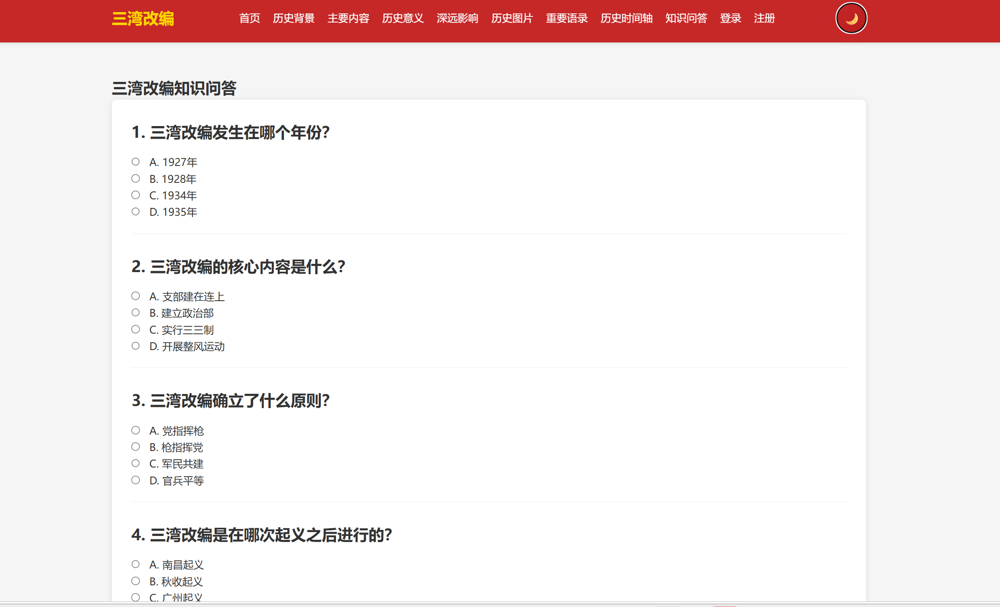

---

### 4.7 重要语录（pages/quotes.html）

该页面收录了8条与三湾改编和人民军队建设相关的重要语录。

**语录来源：**
- 毛泽东："支部建在连上，是我们党领导军队的重要原则……"
- 毛泽东："我们的原则是党指挥枪，而决不容许枪指挥党。"
- 习近平："三湾改编是建设新型人民军队的重要开端……"
- 江泽民、胡锦涛、邓小平等领导人的相关论述

每条语录以卡片形式展示，左侧有红色装饰边框，引用者信息右对齐并以红色标注。

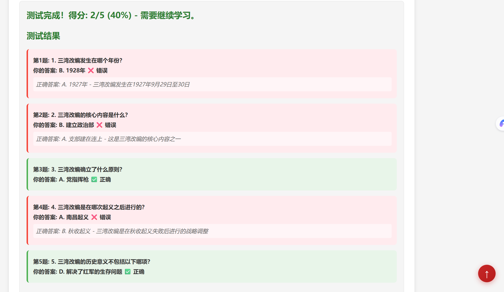

---

### 4.8 历史时间轴（pages/timeline.html）

该页面通过**时间轴**的形式梳理三湾改编前后的一系列重要历史事件。

**时间轴内容：**
| 时间 | 事件 |
|------|------|
| 1927年8月1日 | 南昌起义 |
| 1927年8月7日 | 八七会议 |
| 1927年9月9日 | 秋收起义 |
| 1927年9月29日-10月3日 | **三湾改编**（高亮显示） |
| 1927年10月 | 进军井冈山 |
| 1928年4月 | 井冈山会师 |
| 1929年12月 | 古田会议 |
| 1934年10月 | 开始长征 |
| 1935年1月 | 遵义会议 |

**设计特点：**
- 三湾改编节点采用金色高亮显示，带有脉冲动画效果
- 桌面端采用左右交替布局，时间轴线居中
- 移动端自动切换为左侧单列布局
- 使用AOS动画库实现滚动入场动画
- 卡片悬停时上浮，增加交互感

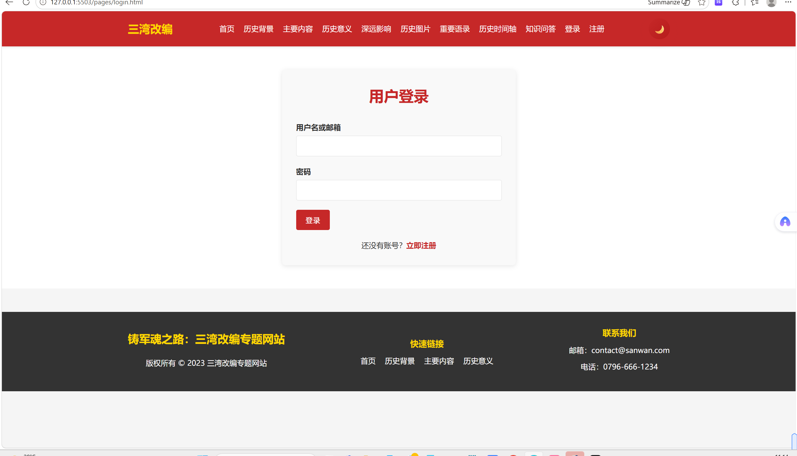

---

### 4.9 知识问答（pages/quiz.html）

该页面提供**5道选择题**供用户自测对三湾改编的了解程度。

**题目内容：**
1. 三湾改编发生在哪个年份？（正确答案：1927年）
2. 三湾改编的核心内容是什么？（正确答案：支部建在连上）
3. 三湾改编确立了什么原则？（正确答案：党指挥枪）
4. 三湾改编是在哪次起义之后进行的？（正确答案：秋收起义）
5. 三湾改编的历史意义不包括哪项？（正确答案：解决了红军的生存问题）

**功能特点：**
- 提交后显示每题的正误判断，绿色为正确、红色为错误、橙色为未作答
- 显示正确答案及详细解析
- 计算并显示总分和评级（优秀/良好/及格/需要继续学习）
- 支持"重置"按钮清除所有选择重新作答
- 提交后自动滚动到结果区域

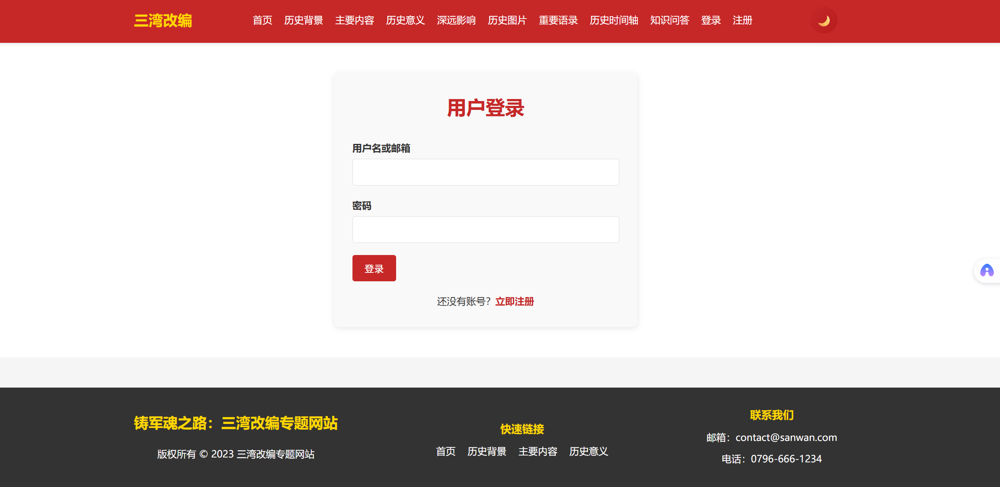

---

### 4.10 登录页面（pages/login.html）

用户登录页面，包含用户名/邮箱和密码两个输入框。表单提交时进行前端验证（非空检查），模拟登录成功后跳转到首页。页面底部提供"立即注册"的跳转链接。

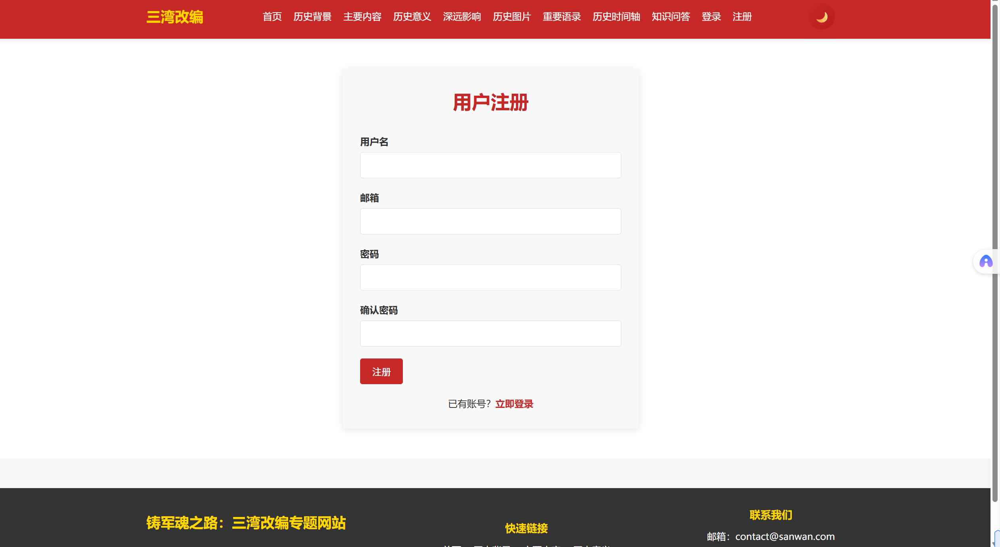

---

### 4.11 注册页面（pages/register.html）

用户注册页面，包含用户名、邮箱、密码、确认密码四个输入框。表单验证包括：两次密码一致性检查、密码长度不少于6位。模拟注册成功后跳转到登录页面。页面底部提供"立即登录"的跳转链接。

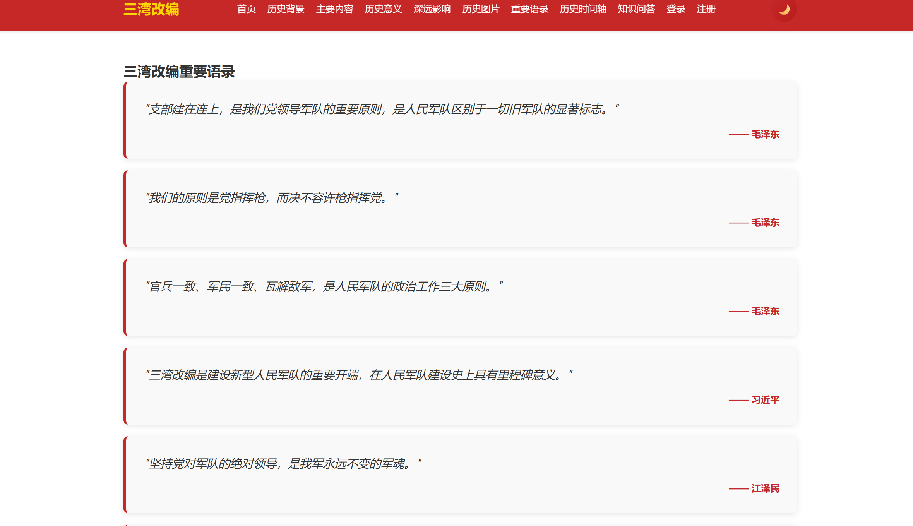

---

## 五、技术实现

### 5.1 技术栈

| 技术 | 说明 |
|------|------|
| HTML5 | 语义化标签，DOCTYPE声明 |
| CSS3 | Grid/Flexbox布局、渐变、动画、过渡、媒体查询 |
| JavaScript (原生) | 无框架依赖，纯原生JS实现所有交互 |
| AOS.js | 第三方动画库（CDN引入），用于滚动入场动画 |

### 5.2 项目目录结构

```
项目根目录/
├── index.html              # 首页
├── css/
│   └── style.css           # 全局样式表（1688行）
├── js/
│   └── script.js           # 全局JavaScript脚本（711行）
├── images/                 # 图片资源（26张图片）
│   ├── w1.jpg ~ w3.jpg     # 轮播图背景
│   ├── m1.jpg ~ m4.jpg     # 功能卡片背景
│   ├── 1.jpg ~ 8.jpg       # 画廊图片
│   ├── a.jpg ~ ji.jpg      # 内容插图
│   └── ...
├── pages/                  # 子页面目录（10个页面）
│   ├── background.html     # 历史背景
│   ├── content.html        # 主要内容
│   ├── significance.html   # 历史意义
│   ├── influence.html      # 深远影响
│   ├── gallery.html        # 历史图片
│   ├── quotes.html         # 重要语录
│   ├── timeline.html       # 历史时间轴
│   ├── quiz.html           # 知识问答
│   ├── login.html          # 登录
│   └── register.html       # 注册
└── 网站图/                 # 网站截图（15张）
```

### 5.3 CSS架构

- **响应式布局**：使用CSS Grid和Flexbox，通过`@media`断点实现桌面端（>768px）和移动端（≤768px、≤480px）的适配
- **CSS变量与主题切换**：通过`body.dark-mode`类名切换明暗主题，localStorage持久化主题偏好
- **动画体系**：包括淡入上移、左右滑入、缩放等多种入场动画，配合延迟类实现错峰动画效果
- **装饰元素**：视差浮动形状（parallax-shape）、渐变装饰条、脉冲动画等

### 5.4 JavaScript功能清单

| 功能模块 | 实现方式 |
|----------|----------|
| 轮播图 | setInterval自动切换 + 手动控制 + 悬停暂停 |
| 导航菜单 | 汉堡菜单 + 移动端侧滑菜单 + 遮罩层 + 窗口大小监听 |
| 注册/登录表单 | 前端验证 + 模拟提交 + 页面跳转 |
| 知识问答 | 答案判断 + 分数计算 + 详细反馈 + 评分等级 |
| 图片懒加载 | IntersectionObserver API |
| 图片灯箱 | 全屏查看 + ESC/点击关闭 + 防止背景滚动 |
| 返回顶部按钮 | 滚动监听 + 平滑滚动 |
| 滚动动画 | IntersectionObserver + CSS类名触发 |
| 视差滚动 | requestAnimationFrame + scroll事件 |
| 明暗主题切换 | classList.toggle + localStorage持久化 |
| 粒子背景 | Canvas绘制 + requestAnimationFrame动画循环 + 粒子连线 |

---

## 六、功能特点总结

### 6.1 用户体验

- **统一的视觉风格**：全站使用一致的红金配色、导航栏和页脚，浏览体验连贯
- **流畅的动画效果**：卡片悬停上浮、滚动入场动画、轮播图渐变切换、脉冲动画等，提升视觉品质
- **移动端友好**：汉堡菜单、响应式网格布局、适配小屏的字体和间距
- **暗色模式**：支持一键切换明暗主题，降低夜间浏览的视觉疲劳

### 6.2 性能优化

- **图片懒加载**：画廊页面的图片仅在进入视口时才加载，减少初始页面加载时间
- **CDN引入**：AOS动画库通过unpkg CDN引入，利用浏览器缓存
- **requestAnimationFrame**：视差滚动和粒子动画使用RAF进行优化，避免不必要的重绘

### 6.3 可访问性

- 语义化HTML标签
- 图片均设有`alt`属性
- 按钮设有`title`提示
- 表单设有`label`关联

---

## 七、设计亮点

1. **粒子背景系统**：首页Canvas粒子背景为网站增添了科技感和动态美，粒子之间随距离产生连线，形成网络状的视觉结构，极具辨识度。

2. **视差滚动效果**：三个半透明的装饰圆形以不同速率随页面滚动而移动，营造出空间纵深感，让原本平面的网页有了立体层次。

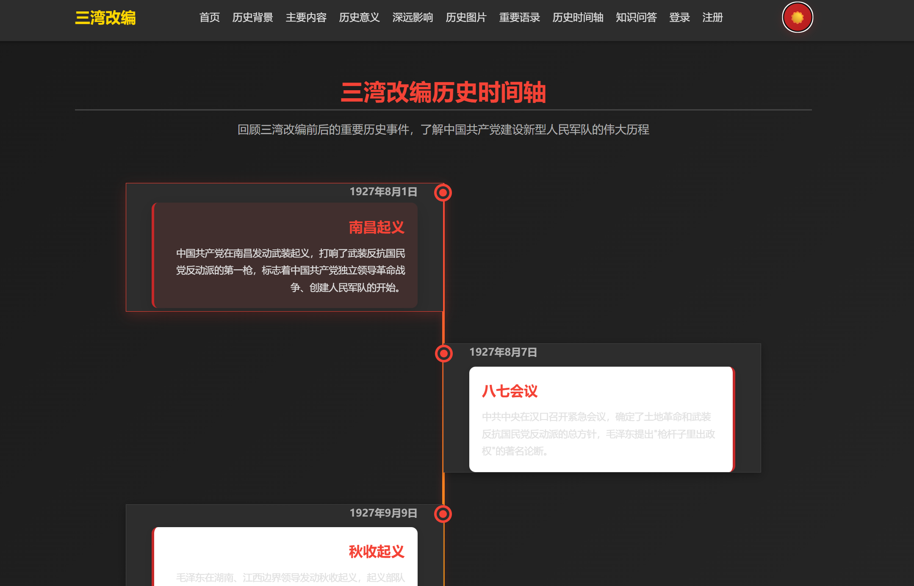

3. **时间轴设计**：历史时间轴采用左右交替布局，中间以红金渐变竖线贯穿，关键事件（三湾改编）以金色圆点高亮并带有脉冲动画，视觉层次分明，信息呈现清晰。

4. **卡片背景融合**：首页四大功能卡片将文字直接叠加在背景图片上，通过半透明遮罩保证文字可读性，比纯色卡片更具视觉冲击力。

5. **统一的顶部装饰条**：内容卡片和详情页均采用红金渐变装饰条作为顶部点缀，形成统一的品牌识别元素。

6. **移动端汉堡菜单**：移动端菜单按钮拥有绿色背景（与桌面端红色区分），激活后变为红色并切换为"✕"图标，交互语义清晰。

---

## 八、总结

"铸军魂之路：三湾改编专题网站"是一个内容详实、设计精美、功能完善的红色教育主题网站。项目涵盖了HTML、CSS、JavaScript三大前端核心技术，实现了轮播图、时间轴、图片画廊、知识问答、用户注册登录、主题切换、粒子动画等多种交互功能。

网站以11个页面系统梳理了三湾改编这一重大历史事件，从历史背景到主要内容，从历史意义到深远影响，配合重要语录、历史时间轴和互动问答，形成了一个完整的历史知识传播体系。在技术实现上，网站采用响应式设计，支持桌面与移动端多设备访问，使用了懒加载、requestAnimationFrame等性能优化手段，体现了良好的前端工程实践。

该项目充分展示了网页设计与制作课程中所学的HTML结构搭建、CSS布局与美化、JavaScript交互编程的综合运用能力，是一次优秀的课程实践作品。

---

